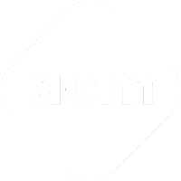

<div align="center">
  <br />
  
  <br />
  
# NSDC Student Chapter Platform - Suryodaya College of Engineering & Technology, Nagpur

**A Next-Generation 3D Web Experience**

[](https://nextjs.org/)
[](https://react.dev/)
[](https://www.typescriptlang.org/)
[](https://tailwindcss.com/)
[](https://threejs.org/)
[](https://www.framer.com/motion/)

**Live Platform:** [usar.nsdc.org](https://usar.nsdc.org)
</div>

---

## 🌟 Overview

Welcome to the official web platform for the **NSDC Student Chapter, Suryodaya College of Engineering & Technology, Nagpur**. This project serves as our central digital hub, designed to showcase our vibrant community, technical events, collaborative projects, and the talented individuals driving our chapter forward.

Built with performance and aesthetics in mind, this platform leverages a **3D World Collaged Generate Design**. It features next-generation glassmorphism, dynamic Three.js 3D elements, fluid scroll animations, and a sleek dark-themed visual presentation.

## ✨ Key Features

- 🌌 **Immersive 3D Experiences**: Built with `React Three Fiber` and `Three.js` for highly interactive, hardware-accelerated graphics.
- 🎭 **Smooth Animations**: Uses `Framer Motion` and `Lenis` for butter-smooth scroll-linked effects and micro-interactions.
- 🚀 **Blazing Fast**: Leveraging Next.js 16 App Router with Static Site Generation (SSG) for sub-second load times and flawless SEO.
- 📅 **Events Dashboard**: A chronological timeline detailing upcoming, ongoing, and past events.
- 📝 **Technical Blog**: A beautifully typography-driven space for curated articles on emerging technologies.
- 👥 **Team Directory**: A comprehensive showcase of our chapter's faculty sponsors, office bearers, and domain captains.
- 🛠️ **Project Showcase**: A dedicated space highlighting the innovative projects built by our members.
- 🎨 **Glassmorphic UI**: A futuristic, high-end design system using Tailwind CSS v4.

---

## 💻 Tech Stack

| Domain | Technologies Used |
| :--- | :--- |
| **Core Framework** | Next.js 16, React 19 |
| **Language** | TypeScript |
| **Styling** | Tailwind CSS v4, `clsx`, `tailwind-merge` |
| **Animations & 3D** | Framer Motion, Three.js, React Three Fiber, React Three Drei, Studio Freight Lenis |
| **Icons** | Lucide React |
| **Tooling** | ESLint, Sharp (Image Optimization) |
| **Deployment** | Static HTML Export (`out/`) |

---

## 📂 Project Structure

```text
nsdc-website/
├── public/                 # Static media (optimized WebP images, fonts, logos)
├── src/
│   ├── app/                # Next.js 16 App Router (Pages & Layouts)
│   ├── components/         # Modular React components (Organized by feature)
│   ├── data/               # Local JSON/TS datasets acting as our CMS (Blogs, Team, Events)
│   └── lib/                # Utility functions and shared helpers
├── scripts/                # Node.js automation scripts (e.g., Image optimization)
├── next.config.ts          # Next.js configuration
└── package.json            # Dependencies and scripts
```

---

## 🚀 Local Development Setup

To get a local copy up and running, follow these simple steps.

### Prerequisites
- [Node.js](https://nodejs.org/) (v20+ recommended)
- `npm` or `yarn`

### 1. Clone the repository
```bash
git clone https://github.com/Arsh199965/NSDC-Website.git
cd NSDC-Website
```

### 2. Install dependencies
```bash
npm install
```

### 3. Start the development server
```bash
npm run dev
```
Open [http://localhost:3000](http://localhost:3000) in your browser to see the result.

---

## 🖼️ Media & Performance Optimization

To maintain peak performance, we aggressively optimize all media assets. 

We provide automated scripts to downscale oversized images and convert them to the highly efficient WebP format. **Always run this script before committing new images to the `public` directory.**

```bash
# Optimize all images in the public folder based on category
node scripts/optimize-by-category.mjs

# Or run the general image optimizer
node scripts/optimize-images.mjs
```

---

## 🏗️ Build & Deployment

The platform is configured for static exporting. To generate a production-ready build:

```bash
npm run build
```
This command compiles the website into a standalone `out/` directory, which can be deployed to any static file hosting service like Vercel, Netlify, or cPanel.


# NSDC_v1
